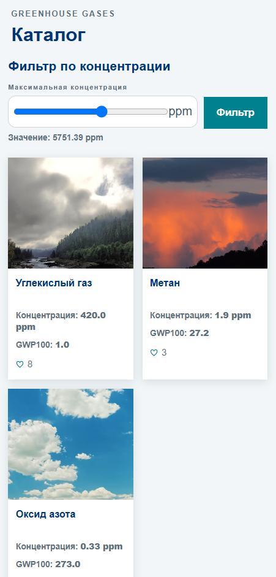
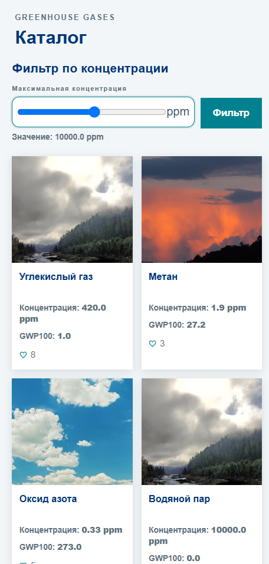
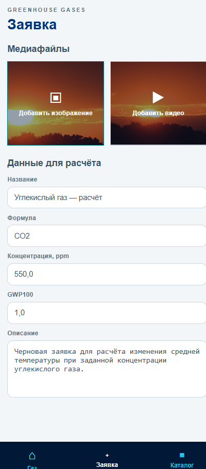
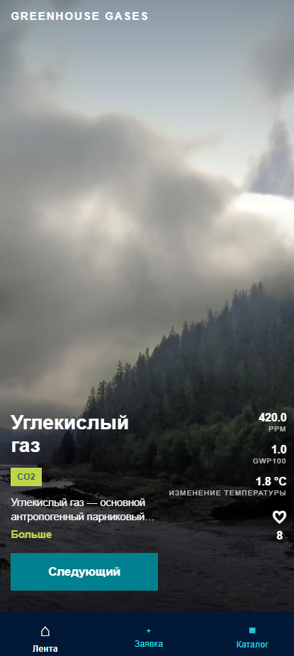

# Исправления по замечаниям к Лабораторной работе №1

## 1. «Тема — поля по теме: ЧТО НУЖНО ДЛЯ РАСЧЕТА в ГАЗЕ»

**Проблема:**
Тема проекта — прогноз температуры на Земле в зависимости от содержания парниковых газов в атмосфере, поэтому в данных должны присутствовать поля, которые непосредственно используются для расчёта.

**Как исправил:**
Добавил в данные парникового газа:

```python
concentration_ppm
global_warming_potential_100y
temperature_change
```

Для расчёта используются концентрация газа и его GWP100.

**Формула:**

```text
C_eff = concentration_ppm × GWP100

ΔT = 3 × log₂(C_eff / 280)
```

где:

* `280 ppm` — базовая концентрация CO₂;
* `3 °C` — используемая климатическая чувствительность;
* `C_eff` — эффективная концентрация газа.

**Код:**

```python
def calculate_temperature_change(
    concentration_ppm,
    global_warming_potential_100y,
):
    effective_concentration = (
        concentration_ppm
        * global_warming_potential_100y
    )

    return round(
        3.0 * math.log2(
            effective_concentration / 280.0
        ),
        1,
    )
```


---

## 2. «Фильтрация ?»

**Проблема:**
В проекте требовалась фильтрация объектов предметной области.

**Как исправил:**
Добавил фильтрацию парниковых газов по концентрации `concentration_ppm`.

```python
if concentration is not None:
    greenhouse_gases = [
        greenhouse_gas
        for greenhouse_gas in greenhouse_gases
        if greenhouse_gas["concentration_ppm"] <= concentration
    ]
```

Пользователь вводит значение концентрации, после чего отображаются только подходящие парниковые газы.


*Фильтр до применения.*

*Результат фильтрации.*

---

## 3. «Цвета: зеленая кнопка прямоугольная, панель белая, карточки тоже, песочный фон»

**Проблема:**
Необходимо было привести цвета и оформление элементов интерфейса к указанному варианту.

**Как исправил:**
Изменил CSS:

* кнопки сделал зелёными;
* убрал скругление кнопок;
* панели сделал белыми;
* карточки сделал белыми;
* фон сделал песочным/светлым.

**Код:**

```css
body {
    background: #e9eef1;
}

.button {
    background: #00818F;
    border-radius: 0;
}

.card {
    background: #ffffff;
    border-radius: 0;
}
```




*Скриншот исправленного интерфейса.*

---

## 4. «Названия в коде: greenhouse_gases»

**Проблема:**
Названия в коде должны соответствовать предметной области проекта.

**Как исправил:**
Привёл названия сущностей, переменных и маршрутов к предметной области парниковых газов.

Используются:

```text
greenhouse_gases
greenhouse_gas
greenhouse_gas_id
```

Вместо названий из исходного шаблона проекта.

Также исправлены названия полей:

```text
title → name
description → short_description
```


---

## 5. Итог

Все указанные замечания были исправлены:

* «Тема — поля по теме: ЧТО НУЖНО ДЛЯ РАСЧЕТА в ГАЗЕ» → добавлены параметры и расчёт изменения температуры;
* «Фильтрация ?» → добавлена фильтрация по концентрации;
* «Цвета: зеленая кнопка прямоугольная, панель белая, карточки тоже, песочный фон» → исправлено оформление;
* «Названия в коде: greenhouse_gases» → названия приведены к предметной области.
