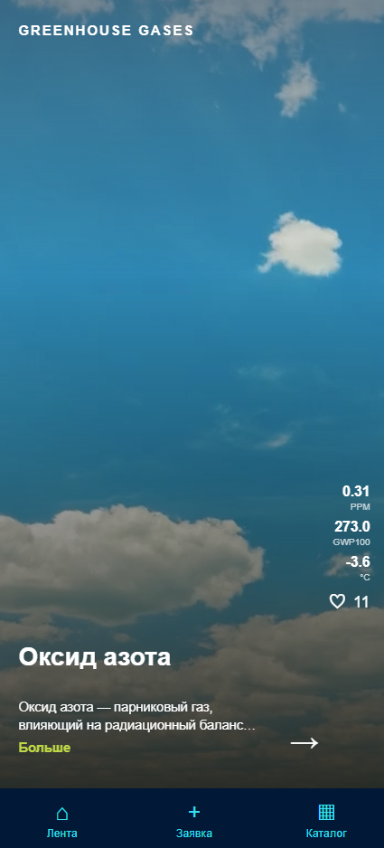
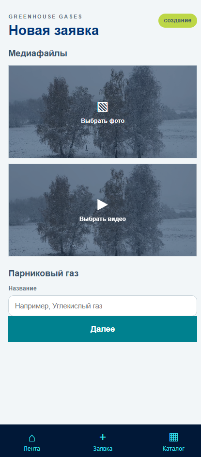
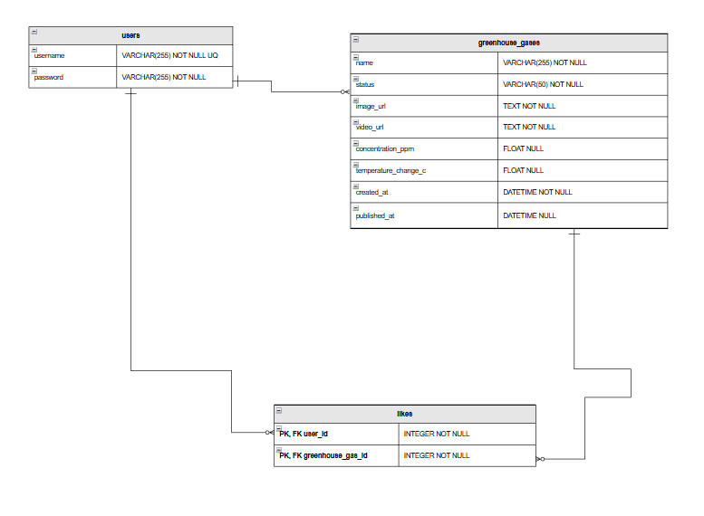

# Пояснения по исправлениям лабораторной работы №2

## Тема проекта

**Прогноз температуры на Земле в зависимости от содержания парниковых газов в атмосфере**

В рамках лабораторной работы были реализованы база данных, работа с парниковыми газами, создание и публикация записей, каталог, лента и расчёт изменения температуры на основе концентрации газа.

После проверки работы преподавателем были внесены следующие исправления.

---

## 1. «следующий сделать иконкой»

### Проблема

Элемент «Следующий» был выполнен в виде обычной кнопки с текстовой надписью.

### Решение

Элемент перехода к следующему опубликованному парниковому газу был переделан в иконку со стрелкой.

Иконка используется для перехода к следующему объекту и занимает меньше места на странице.

### Скриншот

---

## 2. «видео под фото в добавлении»

### Проблема

На странице добавления парникового газа фотография и видео были расположены неправильно относительно друг друга.

### Решение

Блок с видео был размещён непосредственно под фотографией.

Таким образом, медиаматериалы на странице добавления располагаются последовательно: сначала изображение, затем видео.

### Скриншот

---

## 3. Исправления ER-диаграммы

### Проблемы

Преподавателем были отмечены следующие замечания:

* «ПЕРЕДЕЛАТЬ чб, почему желтый поверх»;
* «компактно сделать, убрать названия связей»;
* «URL обязательные (что заполнить по кнопке Далее) в услугах поля необязательные указать»;
* «лишние поля убрать»;
* «добавить пароль».

### Решение

ER-диаграмма была приведена в соответствие с текущей структурой базы данных:

* убрано жёлтое выделение отдельных полей, диаграмма приведена к чёрно-белому оформлению;
* таблицы расположены компактнее;
* убраны текстовые названия связей между таблицами;
* поля `image_url` и `video_url` в таблице `greenhouse_gases` сделаны обязательными (`NOT NULL`);
* необязательные поля отмечены как `NULL`;
* удалена лишняя отдельная строка с обозначением составного первичного ключа таблицы `likes`, так как первичный ключ уже указан непосредственно у полей `user_id` и `greenhouse_gas_id`;
* в таблицу `users` добавлено обязательное поле `password`;
* сохранены внешние ключи и связи между таблицами.

Таким образом, диаграмма стала компактнее, соответствует текущей структуре базы данных и не содержит лишних обозначений.

### Скриншот

---

# Итог

По результатам проверки были исправлены замечания преподавателя:

* элемент «Следующий» заменён на иконку;
* видео размещено под фотографией на странице добавления;
* ER-диаграмма приведена к чёрно-белому стилю;
* ER-диаграмма сделана более компактной;
* убраны названия связей;
* исправлена обязательность URL-полей;
* удалён лишний элемент в описании составного первичного ключа;
* в таблицу `users` добавлено поле `password`;
* структура проекта и предметная область парниковых газов сохранены.
